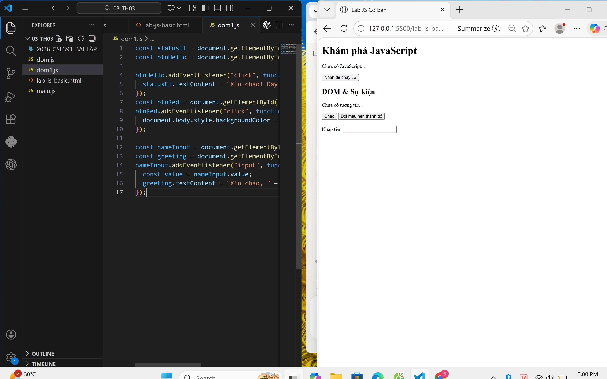
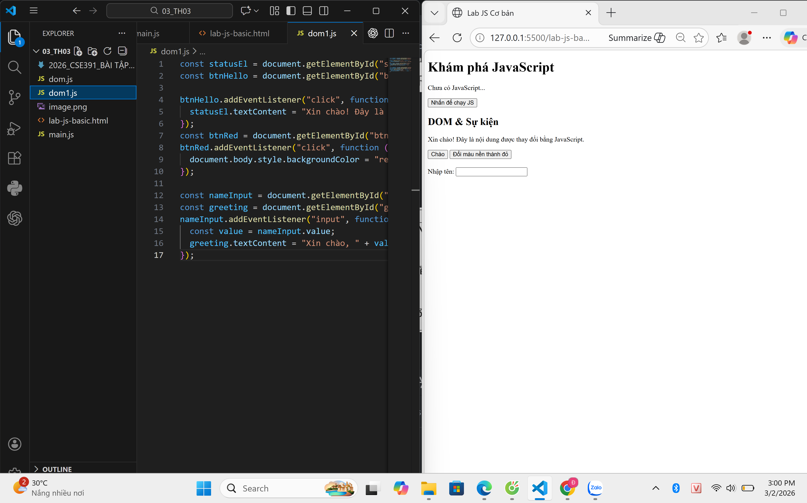
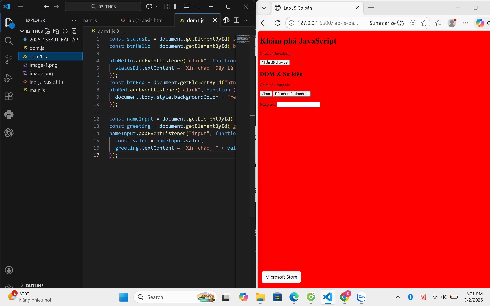

## BTTH03: JS nền tảng, DOM & Sự kiện

**Đối tượng:** Sinh viên chưa học lý thuyết JavaScript

---

## 1. MỤC TIÊU HỌC TẬP

Sau buổi lab, sinh viên có thể:

- Mô tả được JavaScript là gì, chạy ở đâu, khác HTML/CSS ở điểm nào.
- Viết được các đoạn JS đơn giản với:
  - Biến, kiểu dữ liệu cơ bản (number, string, boolean),
  - Cú pháp lệnh, toán tử đơn giản,
  - Cấu trúc điều khiển if/else, vòng lặp đơn giản,
  - Hàm (function) có tham số và giá trị trả về.
- Thao tác được với DOM:
  - Lấy phần tử bằng `document.getElementById`,
  - Thay đổi nội dung văn bản, kiểu dáng (style),
  - Lắng nghe và xử lý một số sự kiện cơ bản: `click`, `input`.
- Nhận biết jQuery là một thư viện hỗ trợ thao tác DOM/sự kiện (ở mức nhận diện, chưa cần sử dụng thành thạo).

---

## 2. CẤU TRÚC THỜI GIAN BUỔI LAB
- 03 tiết thực hành.

---

## 3. HOẠT ĐỘNG 1 (45’): GIỚI THIỆU JS & CÚ PHÁP CƠ BẢN

### 3.1. Chuẩn bị file HTML & JS

Tạo file `lab-js-basic.html`:

```html
<!DOCTYPE html>
<html lang="vi">
<head>
  <meta charset="UTF-8">
  <title>Lab JS Cơ bản</title>
</head>
<body>
  <h1>Khám phá JavaScript</h1>
  <p id="welcome">Chưa có JavaScript...</p>
  <button id="runBtn">Nhấn để chạy JS</button>

  <script src="main.js"></script>
</body>
</html>
```

Tạo file `main.js`:

```js
console.log("Hello from JavaScript!");
```


---

### 3.2. Nhiệm vụ cho sinh viên

#### Bước 1: Mở file \& Quan sát bằng Console

1. Mở `lab-js-basic.html` trong trình duyệt (Chrome/Edge/…).
2. Mở DevTools → tab **Console**.
3. Quan sát thông báo xuất hiện.

> Câu hỏi:
> - Em thấy dòng thông báo nào trong console?
  Hello from JavaScript!
> - Điều này cho em biết JavaScript đang làm gì khi trang web được tải?
  Khi trang web được tải, trình duyệt đọc và thực thi file main.js, lệnh console.log() ghi thông báo ra cửa sổ Console của DevTools.
---

#### Bước 2:  “JavaScript là gì?” (Tra cứu nhanh)

Sử dụng 1–2 nguồn tài liệu (vd. W3Schools, freeCodeCamp, …), tóm tắt:

> a) JavaScript chạy ở đâu? Cả hai (Trình duyệt / Server / Cả hai?)
> b) HTML, CSS, JavaScript mỗi phần chịu trách nhiệm chính về điều gì?
>
> - HTML: Cấu trúc nội dung trang web(tiêu đề, đoạn văn, nút bấm...)
> - CSS: Trình bày giao diện, màu sắc, bố cục, kiểu chữ.
> - JavaScript: Xử lý hành vi, tương tác động(click, tính toán, thay đổi nội dung trang...)

---

#### Bước 3: Thử nghiệm biến \& kiểu dữ liệu trong Console

Trong tab Console, gõ từng dòng sau và ghi lại kết quả:

```js
let age = 20;
const name = "An";
let isStudent = true;

typeof age;
typeof name;
typeof isStudent;

1 + 2 * 3;
"Hello " + "world";
```

> Câu hỏi:
> - Kết quả `typeof age` là gì? "number"
> - Kết quả `typeof name` là gì? "string"
> - Kết quả `typeof isStudent` là gì? "boolean"
> - Em hãy tự mô tả ngắn gọn:
>   - `number` là: kiểu dữ liệu số, dùng để lưu các giá trị số nguyên hoặc số thực để thực hiện tính toán. (Ví dụ: 20, 3.14, -5)
>   - `string` là: kiểu dữ liệu chuỗi ký tự, dùng để lưu văn bản, luôn được đặt trong dấu nháy đơn hoặc nháy đôi. (Ví dụ: "An", "Hello")
>   - `boolean` là: kiểu dữ liệu logic, chỉ có đúng hai giá trị là true (đúng) hoặc false (sai), thường dùng để kiểm tra điều kiện. (Ví dụ: true, false)

---

#### Bước 4: Viết đoạn script tính tuổi

Mở file `main.js`, viết thêm:

```js
let name = "An";
let yearOfBirth = 2005;
let currentYear = 2026;
let age = currentYear - yearOfBirth;

console.log("Xin chào, mình là " + name + ", năm nay mình " + age + " tuổi.");
```

Sau đó:

1. Đổi giá trị `name`, `yearOfBirth` thành thông tin của chính em.
2. Reload trang \& quan sát console.

> Câu hỏi:
> - Dòng log hiển thị gì sau khi em sửa thông tin?
 hiển thị: Xin chào, mình là Đạt, năm nay mình 20 tuổi.
> - Nếu em quên dấu `;` hoặc quên dấu `+`, điều gì xảy ra? Trình duyệt báo lỗi thế nào?
quên dấu '+' thì hiện lỗi: Uncaught SyntaxError: missing ) after argument list

---

#### Bước 5: Phản tư nhanh (Reflection)

> - Điều thú vị nhất em vừa khám phá được về console là gì?
Console không chỉ hiển thị thông báo mà còn có thể dùng như một "máy tính tức thì" — gõ lệnh vào là thấy kết quả ngay, rất tiện để thử nghiệm code mà không cần reload trang.
> - Em gặp lỗi cú pháp nào? Em đã xử lý bằng cách nào (tự sửa, hỏi bạn, đọc lỗi, tìm Google, …)?
Gặp lỗi Uncaught SyntaxError khi quên dấu +. Cách xử lý: đọc thông báo lỗi trong Console — lỗi có ghi rõ dòng số bị lỗi (ví dụ main.js:6), click vào đó để nhảy đúng vị trí, sau đó tự sửa lại dấu + còn thiếu hoặc tra chat GPT.

---

## 4. HOẠT ĐỘNG 2 (40’): CẤU TRÚC ĐIỀU KHIỂN \& HÀM

### 4.1. Chuẩn bị file logic (hoặc viết tiếp trong main.js)

Ví dụ đoạn mã:

```js
// TODO: Đổi giá trị score và quan sát kết quả
let score = 6;

// TODO: Dự đoán điều kiện if/else đang làm gì, rồi chạy thử
if (score >= 8) {
  console.log("Giỏi");
} else if (score >= 6.5) {
  console.log("Khá");
} else if (score >= 5) {
  console.log("Trung bình");
} else {
  console.log("Yếu");
}

// TODO: Viết hàm tính điểm trung bình 3 môn
function tinhDiemTrungBinh(m1, m2, m3) {
  let avg = (m1 + m2 + m3) / 3;
  return avg;
}

// Gợi ý dùng thử hàm trong console:
// tinhDiemTrungBinh(8, 7, 9);
```


---

### 4.2. Nhiệm vụ cho sinh viên

#### Bước 1: Đoán trước – chạy sau

> a) Nếu `score = 9`, em dự đoán console sẽ in: Giỏi
> b) Nếu `score = 6`, em dự đoán console sẽ in: Trung Bình

Sau đó:

1. Thay `score = 9`, reload trang hoặc chạy file và kiểm tra console.
2. Thay `score = 6`, kiểm tra lại.

> So sánh dự đoán và kết quả thực tế:
> - Trường hợp `score = 9`: Dự đoán vs Thực tế: Giống nhau
> - Trường hợp `score = 6`: Dự đoán vs Thực tế: Giống nhau

---

#### Bước 2: Mô tả lại if/else bằng lời

> - Khi nào chương trình in `"Giỏi"`?  score >= 8
> - Khi nào chương trình in `"Yếu"`? score < 5
> - Em hãy mô tả cấu trúc `if/else` bằng lời của em (có thể ví von “ngã rẽ” trong đời sống):
  Nếu em ko đọc bài này thì em ko thấy câu này.
  Ngược lại nếu e đọc bài này thì em sẽ thấy câu này.

---

#### Bước 3: Làm việc với hàm

1. Mở Console, gọi hàm:
```js
tinhDiemTrungBinh(8, 7, 9);
```

> Em ghi lại giá trị hàm trả về: 8

2. Viết thêm hàm `xepLoai(avg)` trong file JS:
```js
function xepLoai(avg) {
  // TODO: Dùng if/else để:
  // avg >= 8  -> "Giỏi"
  // avg >= 6.5 -> "Khá"
  // avg >= 5  -> "Trung bình"
  // còn lại   -> "Yếu"
}
```

3. Gọi thử trong console:
```js
let avg = tinhDiemTrungBinh(8, 7, 9);
let loai = xepLoai(avg);
console.log("Điểm TB:", avg, " - Xếp loại:", loai);
```
Kết quả: Điểm TB: 8  - Xếp loại: Giỏi
> Câu hỏi:
> - Một hàm gồm những phần chính nào?
>   - Tên hàm: Tên dùng để gọi hàm, đặt sau từ khóa function (vd: xepLoai, tinhDiemTrungBinh)
>   - Tham số (parameters):  Các giá trị đầu vào truyền vào hàm khi gọi, đặt trong dấu () (vd: avg, a, b, c)
>   - Thân hàm (body): Các câu lệnh thực thi bên trong cặp dấu {}, là phần xử lý logic chính
>   - Giá trị trả về (return): Kết quả hàm trả lại sau khi xử lý xong, dùng từ khóa return (nếu không có return, hàm trả về undefined)
> - Ưu điểm của việc dùng hàm thay vì lặp lại cùng một đoạn code nhiều lần là gì?
  Tránh lặp lại code — chỉ cần viết logic một lần, sau đó gọi lại nhiều lần ở bất kỳ đâu. Khi cần sửa, chỉ sửa một chỗ duy nhất thay vì sửa nhiều nơi, giúp code gọn gàng và dễ bảo trì hơn.

---

#### Bước 4: Mở rộng nhỏ (tuỳ chọn)

Viết hàm `kiemTraTuoi(age)`:

```js
function kiemTraTuoi(age) {
  // TODO:
  // Nếu age >= 18 -> console.log("Đủ 18 tuổi");
  // Ngược lại -> console.log("Chưa đủ 18 tuổi");
}
```

Gọi thử: `kiemTraTuoi(16);`, `kiemTraTuoi(20);`.

---

#### Bước 5: Phản tư

> - Phần nào trong if/else hoặc hàm khiến em khó hiểu nhất? Phần hàm khiến em khó hiểu nhất
> - Em đã làm gì để vượt qua (thử nhiều lần, hỏi bạn, xem lại ví dụ, tra Google, …)?
  em tra chat GPT, và thử nhiều lần

---

## 5. HOẠT ĐỘNG 3 (40’): THAO TÁC DOM \& SỰ KIỆN

### 5.1. Chuẩn bị HTML

Thêm vào trang (hoặc tạo file mới):

```html
<section>
  <h2>DOM & Sự kiện</h2>
  <p id="status">Chưa có tương tác...</p>

  <button id="btnHello">Chào</button>
  <button id="btnRed">Đổi màu nền thành đỏ</button>

  <div style="margin-top: 20px;">
    <label>Nhập tên: </label>
    <input id="nameInput" type="text" />
    <p id="greeting"></p>
  </div>
</section>

<script src="dom.js"></script>
```

Tạo file `dom.js`:

```js
const statusEl = document.getElementById("status");
const btnHello = document.getElementById("btnHello");

btnHello.addEventListener("click", function () {
  statusEl.textContent = "Xin chào! Đây là nội dung được thay đổi bằng JavaScript.";
});
```


---

### 5.2. Nhiệm vụ cho sinh viên

#### Bước 1: Đọc \& giải thích

> Câu hỏi:
> - `document.getElementById("status")` đang làm gì? Tìm kiếm trong toàn bộ trang HTML phần tử có id="status" và trả về đối tượng đó để JavaScript có thể thao tác — ở đây lưu vào biến statusEl.
> - Sự kiện `"click"` xảy ra khi nào? Xảy ra khi người dùng nhấn chuột vào phần tử đang lắng nghe sự kiện đó (ở đây là nút btnHello).
> - Trong đoạn code trên, khi nhấn nút `btnHello`, điều gì thay đổi trên trang? Nội dung văn bản của thẻ <p id="status"> thay đổi từ "Chưa có tương tác..." thành "Xin chào! Đây là nội dung được thay đổi bằng JavaScript." — người dùng thấy ngay trên trang mà không cần reload.

---

#### Bước 2: Thử nghiệm nút đổi màu nền

Hoàn thiện code:

```js
const btnRed = document.getElementById("btnRed");

btnRed.addEventListener("click", function () {
  // TODO: Đổi màu nền trang thành đỏ
  document.body.style.backgroundColor = "red";
});
```

> Câu hỏi:
> - Em có thể đổi sang màu khác (vd. `lightblue`) không? Hãy thử. Có. Chỉ cần thay "red" thành tên màu khác:
> - Em hãy ghi lại 1 ví dụ khác mà JavaScript có thể làm với `document.body.style`.
document.body.style.backgroundColor = "lightblue";

---

#### Bước 3: Xử lý sự kiện input – gõ tên, hiện lời chào

Hoàn thiện code:

```js
const nameInput = document.getElementById("nameInput");
const greeting = document.getElementById("greeting");

nameInput.addEventListener("input", function () {
  const value = nameInput.value;
  greeting.textContent = "Xin chào, " + value + "!";
});
```

> Câu hỏi:
> - Sự kiện `"input"` khác gì so với `"click"`?
"click" chỉ kích hoạt một lần khi nhấn chuột. Còn "input" kích hoạt liên tục mỗi khi nội dung ô text thay đổi — tức là mỗi lần gõ thêm hoặc xóa một ký tự đều chạy lại hàm ngay lập tức.
> - Khi em xoá hết nội dung ô input, dòng `greeting` hiển thị gì?
Hiển thị: "Xin chào, !" — vì value lúc này là chuỗi rỗng "", nối vào vẫn còn phần "Xin chào, " và dấu !.
---

#### Bước 4: Liên hệ khái niệm DOM

> DOM (Document Object Model) là mô hình biểu diễn trang HTML dưới dạng một **cây các đối tượng** mà JavaScript có thể truy cập và thay đổi.
>
> Em hãy:
> - Tự mô tả DOM bằng lời của em:
>   DOM giống như một sơ đồ cây gia phả của trang web — mỗi thẻ HTML là một "nút" trong cây, JavaScript có thể leo lên leo xuống cây đó để tìm, đọc, hoặc thay đổi bất kỳ phần tử nào trên trang mà không cần tải lại.
> - Nêu 1 ví dụ “thao tác DOM” trong bài (ghi lại 1 dòng lệnh cụ thể).
statusEl.textContent = "Xin chào! Đây là nội dung được thay đổi bằng JavaScript.";
---

#### Bước 5: Ảnh kết quả

Hãy chụp các ảnh màn hình:

1. Khi vừa tải trang (chưa tương tác).
2. Sau khi nhấn “Chào”. 
3. Sau khi đổi nền sang màu đỏ. 
4. Khi gõ tên và nhìn thấy lời chào xuất hiện.

*(Ảnh có thể được yêu cầu nộp cùng bài hoặc dán vào báo cáo)*

---

## 6. KẾT THÚC (15’): GIỚI THIỆU JQUERY \& PHẢN TƯ

### 6.1. Nhìn nhanh jQuery (so sánh với JS thuần)

Ví dụ:

```js
// JS thuần
document.getElementById("btnHello").addEventListener("click", function () {
  alert("Hello from JS!");
});

// jQuery (giả sử đã import jQuery)
$("#btnHello").on("click", function () {
  alert("Hello from jQuery!");
});
```

> Câu hỏi:
> - Điểm giống nhau về chức năng giữa 2 đoạn code trên là gì? Cả hai đoạn code đều làm cùng một việc: lắng nghe sự kiện click vào nút btnHello và hiển thị hộp thoại "Hello" khi người dùng nhấn vào.
> - Điểm khác nhau về cú pháp là gì (`document.getElementById` vs `$("#id")`, `addEventListener` vs `.on`)?
JS thuần  →  Kiểm soát nhiều hơn, không cần thư viện ngoài
jQuery    →  Viết nhanh hơn, cú pháp ngắn gọn hơn
> - Em hãy tra cứu nhanh “What is jQuery used for?” và ghi 2 ý chính:
>   1. Giúp thao tác DOM và xử lý sự kiện ngắn gọn hơn — những tác vụ như tìm phần tử, thay đổi nội dung, hay ẩn/hiện phần tử chỉ cần 1 dòng thay vì 3–4 dòng JS thuần.
>   2. Xử lý sự khác biệt giữa các trình duyệt — jQuery tự động đảm bảo code chạy đúng trên Chrome, Firefox, Safari mà lập trình viên không cần viết code riêng cho từng trình duyệt.

---

### 6.2. Tự đánh giá \& định hướng

> 1. Sau buổi lab, em tò mò nhất về phần nào của JavaScript/DOM? DOM
> 2. Em muốn tự làm thêm tính năng gì trên trang web (vd: bộ đếm, đổi theme, pop-up, mini game, …)? mini game
> 3. Em đánh giá mức độ hiểu của mình về:
>    - Biến \& kiểu dữ liệu: [ ] Chưa hiểu  [ ] Tạm ổn  [v] Khá rõ
>    - If/else \& hàm:       [ ] Chưa hiểu  [ ] Tạm ổn  [v] Khá rõ
>    - DOM \& sự kiện:       [ ] Chưa hiểu  [v] Tạm ổn  [ ] Khá rõ

---

## 7. GHI CHÚ CHO GIẢNG VIÊN (NỘI BỘ)

- Có thể cho SV làm theo cặp/nhóm 2–3 để hỗ trợ nhau thử nghiệm, đọc lỗi, tra cứu.
- Tùy thời lượng thực tế, có thể:
    - Giảm bớt phần mở rộng (hàm `kiemTraTuoi`, tuỳ biến thêm hiệu ứng).
    - Hoặc tăng thêm bài tập DOM (ẩn/hiện một khối, đếm số lần click, v.v.).
- Phiếu học tập tiếp theo có thể chi tiết hóa từng hoạt động thành form trả lời, chỗ dán ảnh, và câu hỏi mini test trắc nghiệm.

```

---```

